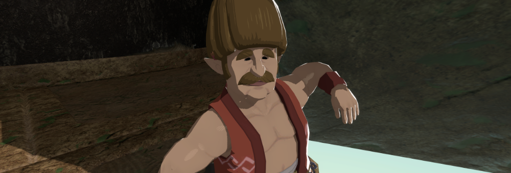
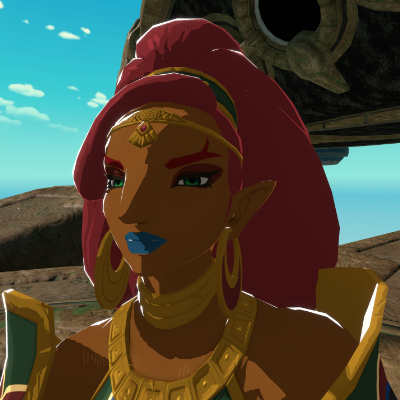
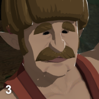
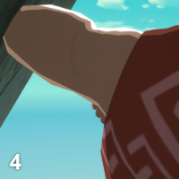
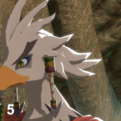

# Toon Shader for Unity

## In the style of Zelda: Breath of the Wild / Tears of the Kingdom

**[Showcase Video](https://youtu.be/f_uh1MZBAPI)**

This is a cartoon shader for Unity emulating the style of Zelda: Breath of the Wild (2017) and its sequel Zelda: Tears of the Kingdom (2023). The shader is intended as a fan art, and it doesn't 100% replicate the look of the game.

Note that this repository **only** contains the shader, and not any Nintendo character, 3D model, or texture. As a demo character it contains [Jammo](https://github.com/mixandjam/Jammo-Character), the character from Youtube channel [Mix&Jam](https://www.youtube.com/mixandjam).

## Artistic features

1. Toon shader with 2/3 bands of light and shadows, specular, and additional artistic light effects. The amount of shading is customisable per-material.
2. Shadows values can be "lifted", so they are never full black.
3. Two modes:
    - The skin/textiles version features a hard distinction between light and shadow, and the specular is rendered as fine brush strokes.
    - The hair/metal version features an additional band of shadows, and the specular is more of a blotch with some noise.
4. A sort of sub-surface scattering: the object, when seen against the main light, is lit on its contours. The effect disappears when seen from the light direction.
5. A strong lateral shine, in the direction of the main light. This is visible also when seen from the light direction. The intensity of this effect can be tuned per-material.
6. Shader is opaque, and supports clipping (cut-out transparency) using the main texture's alpha.
7. Supports normal maps.
8. Supports emission map + color.
9. Supports one additional light (point or spot), with no shadows\*.
10. No support for metallic maps\*.
11. This is purely a shader for dynamic objects. No baking is supported\*.

\* = With some knowledge of Shader Graph, it should be easy to add these as needed.

   

## Technicalities
This shader requires URP 12+ (Unity 2021.2 or later). It supports Forward, Deferred, and Forward+. It doesn't work in HDRP.

To use the shader, all you need is the `Shaders` folder. Just import it in Unity in a URP project. You can discard the other folders `Example` and `Settings`.

The artistic aspects of the shader are all done in Shader Graph. This means you have full control using nodes, though I have exposed some useful variables and given them sensible defaults. In the graph, I've left some notes explaining what the variables do and some of the logic behind the operations.

Underneath, the shader also uses a minimal amount of HLSL (aka custom nodes) to get lighting from Unity (main directional light, additional lights, etc.) into what is essentially an Unlit graph. This code is taken from [Cyanilux](https://twitter.com/Cyanilux)'s wonderful [ShaderGraphCustomLighting](https://github.com/Cyanilux/URP_ShaderGraphCustomLighting) repository, with some modifications by me. If you want to thank someone, thank them for making this possible in the first place.

## Usage
The shader is released under CC0 license. You can use this shader in your games and cutscenes, even for commercial purposes. However, it's provided "as is", so if something breaks or doesn't look the best, it's yours to fix. The shader might also not be fully optimised for all game uses, so I would strongly suggest to take it and customise it to your needs.

## Special thanks
- A big thanks to [Cyanilux](https://twitter.com/Cyanilux), who created the fantastic [library](https://github.com/Cyanilux/URP_ShaderGraphCustomLighting) that made this shader possible. And for giving it out for free.
- Thanks to [André Cardoso](https://twitter.com/andre_mc), for creating [Jammo](https://github.com/mixandjam/Jammo-Character) and sharing it with everyone.
- And obviously thanks to Nintendo for making two of the best games out there.
