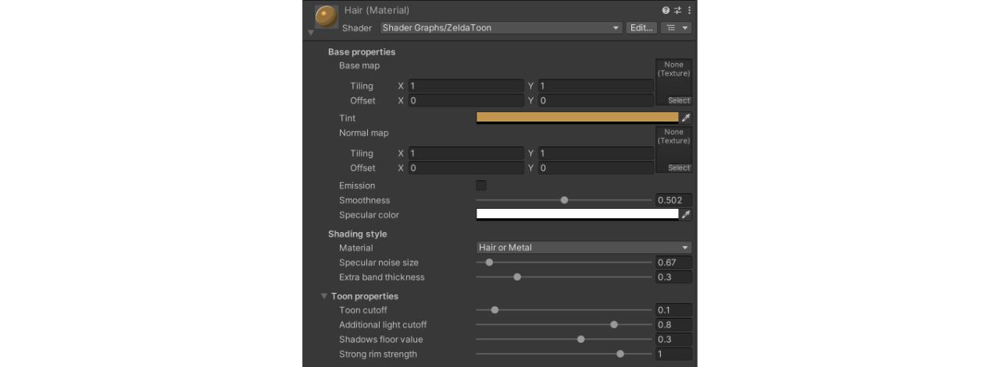

# Toon Shader for Unity
### In the style of Zelda: Breath of the Wild / Tears of the Kingdom

This is a cartoon shader for Unity emulating the style of Zelda: Breath of the Wild (2017) and its sequel Zelda: Tears of the Kingdom (2023). The shader is intended as a fan art, and it doesn't 100% replicate the look of the game.

**[Showcase Video](https://youtu.be/f_uh1MZBAPI)**

Note that this repository **only** contains the shader, and not any Nintendo character, 3D model, or texture. As a demo character it contains [Jammo](https://github.com/mixandjam/Jammo-Character), the character from Youtube channel [Mix&Jam](https://www.youtube.com/mixandjam).

## 👉🏻 How to use
Download the shader from the Releases page, and simply unzip the Shader folder into your URP project (Unity 2022).

## 🎨 Artistic features

Toon shader with 2/3 bands of light and shadows, specular, and additional artistic light effects.

It supports a main directional light, and one additional light (spot or point). Despite being an Unlit shader, it can cast and receive shadows.

Like in the game, it features a sort of "sub-surface scattering": the object, when seen against the main light, is lit on its contours. The effect disappears when seen from the light direction.

Another main feature taken from the game is a strong lateral shine, in the direction where the main light is coming from. The intensity of this effect can be tuned per-material or removed altogether (see properties below).

Other features:
- Shader is opaque, and supports clipping (cut-out transparency) using the main texture's alpha.
- Supports normal maps.
- Supports emission map + color.
- Supports fog.
- No support for metallic maps *.
- This is purely a shader for dynamic objects. No baking is supported *.

(*) = With some knowledge of Shader Graph, it should be easy to add these as needed.

Here's a description of the exposed properties:

### Base properties
These are your typical properties (Base map, Normal map, Tint colour...) made to mirror the usual base properties of Lit shaders.

### Shading style
Choose between two modes. Each one displays different properties.  

A. **Skin or Textiles**  
Features a hard distinction between light and shadow, and the specular is rendered as fine brush strokes.
    
- **Paintbrush strokes size:** the size of the paintbrush strokes used for the specular.
- **Paintbrush strokes angle:** paintbrush strokes are oriented to this angle, relative to the UVs.  

B. **Hair or Metal**  
Features an additional band of shadows, and the specular is more of a blotch with some noise.

- **Specular noise size:** the size of the noise grain breaking the specular shape  
- **Extra band thickness:** the thickness of the extra stripe of mid-tone shadows.

### Toon properties

- **Toon cutoff:** this value determines which brightness value is the threshold between shadows and light.  
- **Additional light cutoff:** when using the additional light, it will only be shown if the dot product of the angle of the light with respects to this surface is above this value. Lowering this value will show bigger patches of light. The effect can be used to make sure that even if the light is very close, it doesn't flood characters.  
- **Shadows floor value:** can be used to get rid of fully black shadows, by lifting the value of black by this amount (i.e. setting it to 0.2 makes the darkest shadow point have a 0.2 brightness). The brightest point is unaffected, and will have a brightness of 1.  
- **Strong rim strength:** the brightness of the white rim effect. A value of 0 will make it disappear, a value of 1 makes it fully white. It can be brought up to 1.2, so the rim shines when using a Bloom post-processing effect.

## ⚙️ Technicalities
This shader requires URP 12+ (Unity 2021.2 or later). It supports Forward, Deferred, and Forward+. It doesn't work in HDRP.

To use the shader, all you need is the `Shaders` folder. Just import it in Unity in a URP project. You can discard the other folders `Example` and `Settings`.

The artistic aspects of the shader are all done in Shader Graph. This means you have full control using nodes, though I have exposed some useful variables and given them sensible defaults. In the graph, I've left some notes explaining what the variables do and some of the logic behind the operations.

Underneath, the shader also uses a minimal amount of HLSL (aka custom nodes) to get lighting from Unity (main directional light, additional lights, etc.) into what is essentially an Unlit graph. This code is taken from [Cyanilux](https://twitter.com/Cyanilux)'s wonderful [ShaderGraphCustomLighting](https://github.com/Cyanilux/URP_ShaderGraphCustomLighting) repository, with some modifications by me. If you want to thank someone, thank them for making this possible in the first place.

## 📃 Usage and license
The shader is released under CC0 license. You can use this shader in your games and cutscenes, even for commercial purposes. However, it's provided "as is", so if something breaks or doesn't look the best, it's yours to fix. The shader might also not be fully optimised for all game uses, so I would strongly suggest to take it and customise it to your needs.

## 🙏🏻 Special thanks
- A big thanks to [Cyanilux](https://twitter.com/Cyanilux), who created the fantastic [library](https://github.com/Cyanilux/URP_ShaderGraphCustomLighting) that made this shader possible. And for giving it out for free.
- Thanks to [André Cardoso](https://twitter.com/andre_mc), for creating [Jammo](https://github.com/mixandjam/Jammo-Character) and sharing it with everyone.
- And obviously thanks to Nintendo for making two of the best games out there.